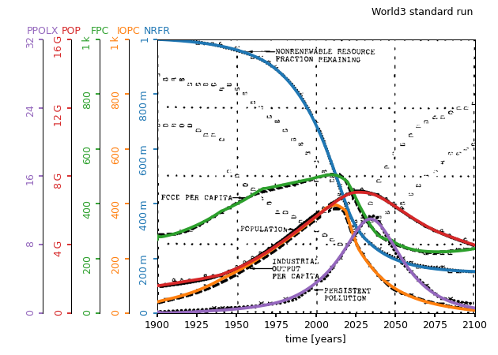

> The World3 model revisited in Python

[](https://opensource.org/licenses/CECILL-2.1)

+ [Install & Hello World3](#Install-and-Hello-World3)
+ [How to tune your own simulation](#How-to-tune-your-own-simulation)
+ [Licence](#Licence)
+ [References & acknowledgment](#References-and-acknowledgment)

---

PyWorld3 is a Python implementation of the World3 model, as described in
the book *Dynamics of Growth in a Finite World*. This version slightly differs
from the previous one used in the world-known reference *the Limits to Growth*,
because of different numerical parameters and a slightly different model
structure.

The World3 model is based on an Ordinary Differential Equation solved by a
Backward Euler method. Although it is described with 12 state variables, taking
internal delay functions into account raises the problem to the 29th order. For
the sake of clarity and model calibration purposes, the model is structured
into 5 main sectors: Population, Capital, Agriculture, Persistent Pollution
and Nonrenewable Resource.

# Install and Hello World3

Install pyworld3 either via:
```
pip install pyworld3
```

or by cloning the repository, installing the requirements ``numpy``, ``scipy``
and ``matplotlib`` and do:

```
python setup.py install
```

Run the provided example to simulate the standard run, known as the *Business
as usual* scenario:
``` Python
import pyworld3
pyworld3.hello_world3()
```

As shown below, the simulation output compares well with the original print.
For a tangible understanding by the general audience, the usual chart plots the
trajectories of the:
- population (`POP`) from the Population sector,
- nonrenewable resource fraction remaining (`NRFR`) from the Nonrenewable Resource sector,
- food per capita (`FPC`) from the Agriculture sector,
- industrial output per capita (`IOPC`) from the Capital sector,
- index of persistent pollution (`PPOLX`) from the Persistent Pollution sector.



# How to tune your own simulation

One simulation requires a script with the following steps:
``` Python
from pyworld3 import World3

world3 = World3()                    # choose the time limits and step.
world3.init_world3_constants()       # choose the model constants.
world3.init_world3_variables()       # initialize all variables.
world3.set_world3_table_functions()  # get tables from a json file.
world3.set_world3_delay_functions()  # initialize delay functions.
world3.run_world3()
```

You should be able to tune your own simulations quite quickly as long as you
want to modify:
- **time-related parameters** during the instantiation,
- **constants** with the `init_world3_constants` method,
- **nonlinear functions** by editing your modified tables
`./your_modified_tables.json` based on the initial json file
`pyworld3/functions_table_world3.json` and calling
`world3.set_world3_table_functions("./your_modified_tables.json")`.

# Licence

The project is under the CeCILL 2.1 licence, a GPL-like licence compatible with international and French laws. See the [terms](./LICENCE) for more details.

# References and acknowledgment

-  Meadows, Dennis L., William W. Behrens, Donella H. Meadows, Roger F. Naill,
Jørgen Randers, and Erich Zahn. *Dynamics of Growth in a Finite World*.
Cambridge, MA: Wright-Allen Press, 1974.
- Meadows, Donella H., Dennis L. Meadows, Jorgen Randers, and William W.
Behrens. *The Limits to Growth*. New York 102, no. 1972 (1972): 27.
- Markowich, P. *Sensitivity Analysis of Tech 1-A Systems Dynamics Model for
Technological Shift*, (1979).